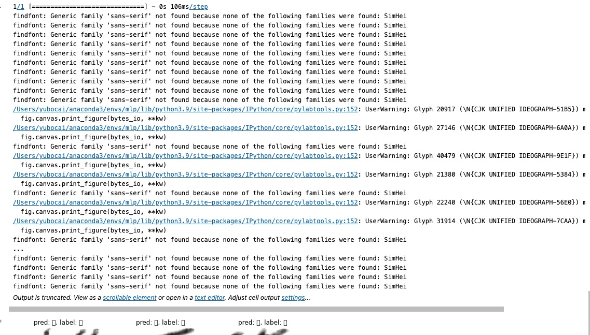

# Instruction of solving the problem of label display of Chinese characters in Mac OS

Original Source: [MacOS系统下matplotlib中SimHei中文字体缺失报错的解决办法](https://blog.csdn.net/u012744245/article/details/119735461?utm_medium=distribute.pc_relevant.none-task-blog-2~default~baidujs_baidulandingword~default-0-119735461-blog-113743015.235^v36^pc_relevant_default_base3&spm=1001.2101.3001.4242.1&utm_relevant_index=3). However, in this article is in `Chinese`. Therefore, I will translate it into `English` and add some of my own experience.

## Problem Description

When we use `matplotlib` to display Chinese characters in `Mac OS`, you may encounter the following error due to the lack of Chinese fonts:

```python
import matplotlib.pyplot as plt
plt.rcParams['font.sans-serif'] = ['SimHei'] 
plt.rcParams['axes.unicode_minus'] = False
```

<div align=center>
  <figure style="display: inline-block; margin: 0 20px;">
    
  </figure>
</div>

## Step 1: find the path of the font file

First, we need to enter the `Python3` environment in the terminal, and then import the `matplotlib` library. Then we can use the following command to find the path of the font file:

```python
import matplotlib    
print(matplotlib.matplotlib_fname())
```
For example, my path is `/Users/yubocai/anaconda3/envs/mlp/lib/python3.9/site-packages/matplotlib/mpl-data/matplotlibrc`.

## Step 2: Download Simhei font

Here you can find the link of Simhei font: [Simhei](https://www.wfonts.com/font/simhei). After downloading, you can find the `SimHei.ttf` file in the `Simhei` folder.

## Step 3: Copy the font file to the path found in Step 1

Copy the `SimHei.ttf` file to the path found in Step 1. For example, my path is `/Users/yubocai/anaconda3/envs/mlp/lib/python3.9/site-packages/matplotlib/mpl-data/fonts/ttf`. **Note** that this time is in his `ttf` folder.

## Step 4: Clean the cache of matplotlib

```python
import matplotlib
print(matplotlib.get_cachedir())
```
Then you can get `/Users/your_compute_name/.matplotlib`. Then exist python environment and delete the file with
```bash
rm -rf /Users/your_compute_name/.matplotlib
```

## Step 5: adjust the orginal file of matplotlib

Open the file `matplotlibrc` in the path found in Step 1, and find the following code:

```python
# remove the #
font.family:  sans-serif

# remove the #，and add SimHei

font.sans-serif: SimHei, DejaVu Sans, Bitstream Vera Sans, Computer Modern Sans Serif, Lucida Grande, Verdana, Geneva, Lucid, Arial, Helvetica, Avant Garde, sans-serif

# remove the #，Change True to False
axes.unicode_minus: False  # use Unicode for the minus symbol rather than hyphen.  See
                           # https://en.wikipedia.org/wiki/Plus_and_minus_signs#Character_codes
```

## Step 6: Clean the cache of your Jupyter Notebook and Restart the Kernel

Then every thing should be fine. You don't even need the code `plt.rcParams['font.sans-serif'] = ['SimHei']` to display Chinese characters.