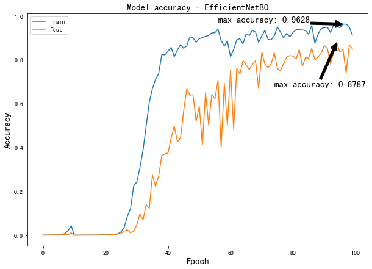

# OCR for Chinese Characters with CNN and EfficientNet

> This is the final project of CSE204 Machine Learning course in Ecole Polytechnique. We use CNN and EfficientNet model to do OCR for singular handwriting Chinese Characters. The project is mainly based on Tensorflow 2.0 API. Here we have a static online version for the project, please visit in this [link](https://yubocai-poly.github.io/ocr_static.html)

## Contributors

- [Junyuan Wang](https://github.com/frank2002)
- [Yubo Cai](https://github.com/yubocai-poly)

## Table of Contents

- [Introduction](#1-introduction)
- [Packages Prerequisites](#2-packages-prerequisites)
- [Data Preparation](#3-dataset-preparation)
- [Model Construction](#4-model-construction)
- [Model Training](#5-model-training)
- [Results of the Models](#6-results-of-the-model)
- [Download Link for Datasets and Model Checkpoints](#7-download-link-for-datasets-and-model-checkpoints)
- [References](#8-bibliography)

## Some Notification

For all the dataset and trainning checkpoints, you can got to [Part 7](#7-download-link-for-datasets-and-model-checkpoints). You need to place the dataset in the `./dataset` folder and the checkpoints in the main folder of this project.

If you are using **Mac OS** and have problem label the Chinese characters with `Matplotlib`, this [document](MacLabel_Problem.md) may help you.

## 1. Introduction

When we learn CNNs in machine learning, we used the MNIST dataset for image recognition. This data set contains 26 letters of the alphabet as well as numbers. Therefore we would like to try OCR recognition for Chinese handwritten characters. However, the difficulty of this is very high compared to MNIST.

|  | Chinese Characters | MNIST (English Alphabet) |
| --- | --- | --- |
| Number of Characters | 10k+ | 26 |
| Structure | More Complex | Relatively simple |
| Diversity of writing styles | A large number of different writing styles as well as continuous strokes | More fixed |

The main reasons why Chinese handwritten OCR is more difficult than MNIST are the following:

1. There are **more than 10k** Chinese Characters which is much more than the 26 letters in MNIST. Therefore, it's quite difficult to label the data and build a complex model to recognize all the characters with high accuracy.

2. Chinese characters are more complex in shape. Compared the MNIST dataset, Chinese characters have a higher number of strokes, more complex shapes, and more variants and fonts exist, thus requiring more advanced image processing and feature extraction techniques for recognition.

3. There are numerous variations and styles of Chinese writing, such as Cursive (草书), Semi-cursive script (行书) and Regular script (楷书). [[More information about Chinese script styles]](https://en.wikipedia.org/wiki/Chinese_script_styles).
 
<div align=center>
  <figure style="display: inline-block; margin: 0 20px;">
    
    <figcaption>(草书)</figcaption>
  </figure>
  <figure style="display: inline-block; margin: 0 20px;">
    
    <figcaption>(行书)</figcaption>
  </figure>
  <figure style="display: inline-block; margin: 0 20px;">
    
    <figcaption>(楷书)</figcaption>
  </figure>
</div>

## 2. Packages Prerequisites

Here we provide the requirements.txt file for the packages prerequisites. You can install all the packages by running the following command:

```bash
pip install -r requirements.txt
```

**Note:** If you are using **Apple Silicon M1/M2**, the installation of `tensorflow` may fail. You can find the solution in [this webpage](https://caffeinedev.medium.com/how-to-install-tensorflow-on-m1-mac-8e9b91d93706).

## 3. Dataset Preparation

Here we use the data from [CASIA's open source Chinese handwriting dataset](http://www.nlpr.ia.ac.cn/databases/handwriting/GTLC.html). In our project, we only use the **Offline CASIA-HWDB 1.0-1.2 Database**. All data in the version 1.0-1.2 are single-word and 2.0-2.2 is sentence-level which require **CRNN**. This dataset contains 7185 Chinese characters and 171 English letters, numbers, punctuation, etc. More detailed information in this [link](http://www.nlpr.ia.ac.cn/databases/handwriting/Offline_database.html).

You can operate the following command to download the dataset:

```bash
cd local_address_to_this_project/dataset
chmod u+x get_hwdb_1.0_1.1.sh
get_hwdb_1.0_1.1.sh
```

After downloading the dataset and unzip it, you can find a **train** folder and a **test** folder. However, the format of the dataset is `gnt` with 32 characters and labels which is not convenient for us for trainning. Therefore, we provide a script to convert the dataset to `png` format with labels. We can run the following command to convert the dataset into `tfrecord` format:

```bash
cd local_address_to_this_project/dataset
python3 convert_to_tfrecord.py HWDB1.1tst_gnt
python3 convert_to_tfrecord.py HWDB1.1trn_gnt
```

### Dataset definition

Here we store the image, the width and height of the image, and the label of the image in the `tfrecord` file. For the label part, to avoid the problem of encoding and decoding chinese characters, we use the number to label different characters and provide a `dictionary` to map the number to the corresponding character. The dictionary is provided at `dataset/characters.txt`.


After the conversion, the dataset will be defined as following:
```python
tf.train.Example(features=tf.train.Features(
      feature={
            "label": tf.train.Feature(int64_list=tf.train.Int64List(value=[index])),
            'image': tf.train.Feature(bytes_list=tf.train.BytesList(value=[img.tobytes()])),
            'width': tf.train.Feature(int64_list=tf.train.Int64List(value=[w])),
            'height': tf.train.Feature(int64_list=tf.train.Int64List(value=[h])),
      }))
```


We also provide the converted dataset in the following link. You can directly use it for training.
- [test.tfrecord](https://drive.google.com/file/d/1knT-6pgkTKmvAp-fivCMUtOU9rRG_X-P/view?usp=sharing)
- [train.tfrecord](https://drive.google.com/file/d/1BhisIm3ebKTLasUx-VNGtIGXYEFJjtlc/view?usp=sharing)

## 4. Model Construction

We use Three models for this project. The first one is a **simple CNN** model, second one is a more **complex CNN** model, and the third one is a **pre-trained EfficientNetB0** model. 

Here we just simply use the `tf.keras` API to build the model to build the CNN model. For the **simple CNN** model, we just add 2 convolutional layer and 2 maxpooling layer. For the **pre-trained EfficientNetB0** model, we use the API from tensorflow as follows:

```python
def effcientnetB0_model():
    inputs = layers.Input(shape=(IMG_SIZE, IMG_SIZE, 3))  # EfficientNetB0 expects 3 channels
    base_model = EfficientNetB0(include_top=False, input_tensor=inputs, weights='imagenet')
    x = base_model.output
    x = layers.GlobalAveragePooling2D()(x)
    x = layers.Dense(num_classes, activation='softmax')(x)
    model = keras.Model(inputs=inputs, outputs=x)
    return model
```

## 5. Model Training

Since the dataset is quite large, we use the tensorflow dataset format to load the data. Since the model might converge very slow, we use the checkpoint saving and logging callback functions to tracking the training of model. 

We save the model with the lowest validation loss automatically through training to prevent the model from over-fitting and data-loss.
  
  ```python
  tf.keras.callbacks.ModelCheckpoint(ckpt_path,
                                            save_weights_only=True,
                                            verbose=1,
                                            save_freq='epoch',
                                            save_best_only=True),
```
The checkpoints are saved in the `checkpoints` folder. You can find pretrained checkpoints at the end of this document.

The training progress and statistics are saved in the `history.pickle` file. You can find the plotted training history in the `Graphs` folder.

### Time comparing

The complexity of two models are quite different. The simple CNN model is quite simple and the training time is quite short. However, the pre-trained EfficientNetB0 model is quite complex and the training time is quite long. Here we provide the training time for the two models.

#### Simple CNN model:
```
Epoch 18/100
1021/1024 [============================>.] - ETA: 0s - loss: 0.5518 - accuracy: 0.8602
Epoch 18: val_loss did not improve from 3.84623
1024/1024 [==============================] - 15s 14ms/step - loss: 0.5533 - accuracy: 0.8600 - val_loss: 4.1783 - val_accuracy: 0.4251
Epoch 19/100
1021/1024 [============================>.] - ETA: 0s - loss: 0.5509 - accuracy: 0.8620
Epoch 19: val_loss did not improve from 3.84623
1024/1024 [==============================] - 15s 15ms/step - loss: 0.5501 - accuracy: 0.8621 - val_loss: 4.2877 - val_accuracy: 0.3924
```

#### Pre-trained EfficientNetB0 model:
```
Epoch 1/100
1024/1024 [==============================] - ETA: 0s - loss: 0.0365 - accuracy: 0.9904
Epoch 1: val_loss improved from inf to 0.52021, saving model to ./checkpoints/efficient_net\cn_ocr-1.ckpt
1024/1024 [==============================] - 158s 147ms/step - loss: 0.0365 - accuracy: 0.9904 - val_loss: 0.5202 - val_accuracy: 0.8870
Epoch 2/100
1024/1024 [==============================] - ETA: 0s - loss: 0.1560 - accuracy: 0.9588
Epoch 2: val_loss did not improve from 0.52021
1024/1024 [==============================] - 149s 146ms/step - loss: 0.1560 - accuracy: 0.9588 - val_loss: 0.6349 - val_accuracy: 0.8544
```


## 6. Results of the model

### 6.1 Simple CNN Model

In fact we were surprised that this simple CNN model had some recognition rate, considering the complex structure of Chinese characters and the large number of writing styles in our dataset. The accuracy of the simple CNN model is around 40% for the `testing dataset` and 97% for `training dataset` after about 60 epoches which is not bad for a simple model.

<div align=center>
  <figure style="display: inline-block; margin: 0 20px;">
    
  </figure>
  <figure style="display: inline-block; margin: 0 20px;">
    
  </figure>
</div>

We test some random images from the testing dataset and the results are as follows:

<div align=center>
  <figure style="display: inline-block; margin: 0 20px;">
    
  </figure>
</div>

We can see that there are 4 correct prediction among the 9 images. However, we are not satisfied with the results. Therefore, we try to use a more complex CNN model to improve the accuracy.

### 6.2 Complex CNN Model

Interestingly, after our training and testing, we found that this complex model did not converge and the accuracy was still very low after almost 200 epoches of training. It is probably due to the reason below:

Optimization Difficulty: Deeper networks are harder to train. Gradients can vanish or explode as they are backpropagated through many layers, making learning difficult. Although batch normalization and careful initialization can help, they may not completely solve the problem.

Another possible reason is that the complex model is not suitable for the dataset. The model cannot capture the features of the dataset and the model cannot converge.

### 6.3 Pre-trained EfficientNetB0 Model

We use the pre-trained EfficientNetB0 model to train our dataset. The accuracy of the EfficientNetB0 model is around 87% for the `testing dataset` and 96% for `training dataset` after about 60 epoches which in a huge improvement compared to the simple CNN model.

<div align=center>
  <figure style="display: inline-block; margin: 0 20px;">
    
  </figure>
  <figure style="display: inline-block; margin: 0 20px;">
    
  </figure>
</div>

We test some random images from the testing dataset and the results are as follows:

<div align=center>
  <figure style="display: inline-block; margin: 0 20px;">
    
  </figure>
</div>

We can see that there are 7 correct prediction among the 9 images. We think this is a very good result, considering that we are analysing images of such a complex structure that many words are difficult to distinguish with our observations.

## 7. Download Link for Datasets and model checkpoints

>  **Directly download link for all Datasets and training checkpoints can be founded below**

The link below can be used to download processed data and trained model checkpoints file. The datasets have been already converted to `tfrecord`. The checkpoints provided have a validation accuracy around 40% for simple CNN model and 87% for EfficientNetB0 model.
- [Dataset & Checkpoints](https://frrl.xyz/dataset)
- [Checkpoints only](https://frrl.xyz/ckpt)

### Usage
1. Unzip the files after downloading. 
2. Merge the folder in the zip file into the project root directly.

## 8. Bibliography

[1] Ralf C Staudemeyer and Eric Rothstein Morris. “Understanding LSTM–a tutorial into long short-term memory recurrent neural networks”. In: arXiv preprint arXiv:1909.09586 (2019).

[2] Mingxing Tan and Quoc V. Le. EfficientNet: Rethinking Model Scaling for Convolutional Neural Networks. 2020. arXiv: 1905.11946 [cs.LG].

[3] Alex Graves et al. “Connectionist temporal classification: labelling unsegmented sequence data with recurrent neural networks”. In: Proceedings of the 23rd international conference on Machine learning. 2006, pp. 369–376.

[4] Yong Yu et al. “A review of recurrent neural networks: LSTM cells and network architectures”. In: Neural computation 31.7 (2019), pp. 1235–1270.

